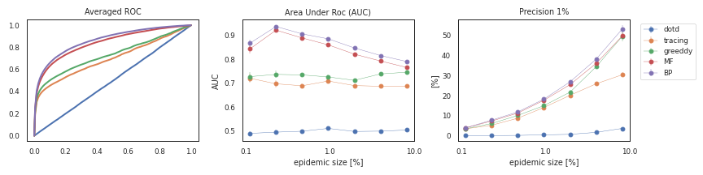
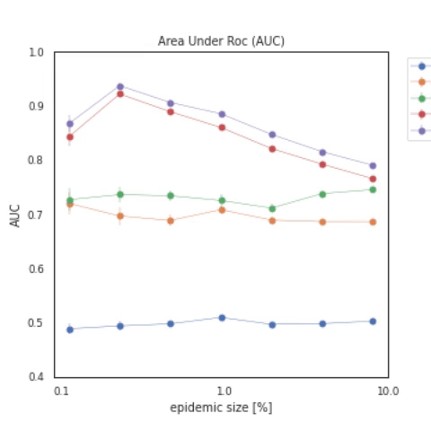
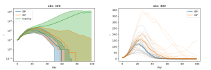
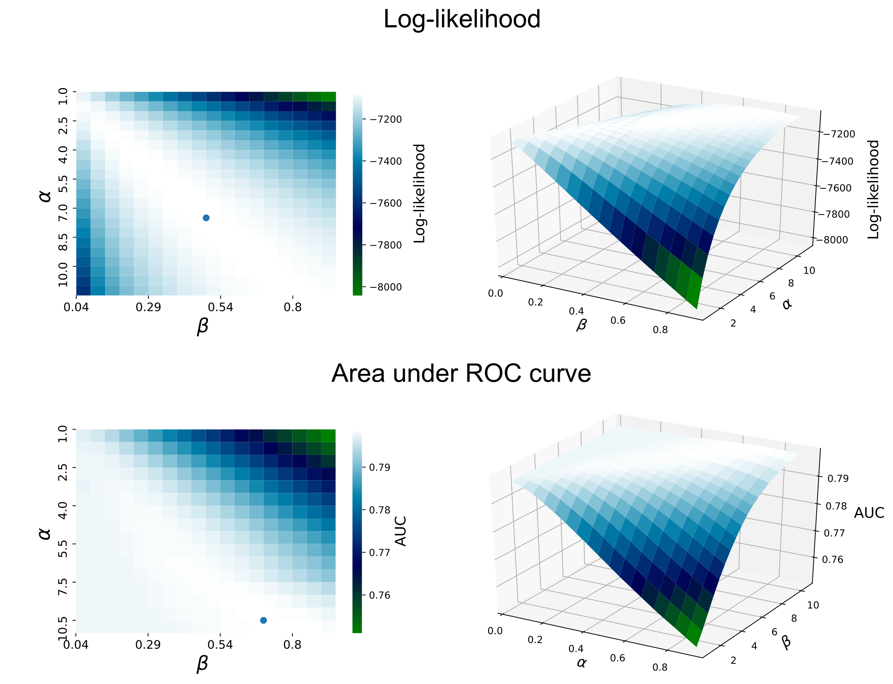

# Epidemic tracing through Statistical Inference

## Table of contents
* [Message-Passing strategies for epidemic tracing](#message-passing-strategies-for-epidemic-tracing)
* [Epidemic Control](#epidemic-control)
* [Inference of epidemic parameters](#inference-of-epidemic-parameters)
* [References](references)

## Message-Passing strategies for epidemic tracing

We show the effectiveness of strategies built on message-passing, **Belief Propagation**\[1,2\] and **Mean-Field**\[3,4\], and compare with a simple heuristic strategy for estimating infection risk consisting in ranking each individual by the number of contacts other individuals that either showed symptoms of various degrees orhave been tested positive:

* **BP**: we build a probability distribution over all possible histories of disease spreading \[1\]. The inference procedure consists in passing a set of so-called *cavity messages* along the edges of the network. At convergence, BP equations yield an approximation to the posterior distribution given the observations and the current estimate of transmission and recovery parameters. This method, that represents an exact Bayesian inference on networks without loops \[1\], has beens hown to produce excellent results in a variety of partially observable settingson disease spreading;
* **MF**: Mean-Field simplification of Dynamical Message Passing equations \[3\]. These equations are derived from the full dynamical process where variables are the full trajectories. See https://github.com/sphinxteam/sir_inference for more details;
* **Tracing**: at time t, individuals are ranked according to the number of contacts with individuals who tested positive in the time interval \[t−τ, t\[.

## ROCS
ROC curves and precisions at differents epidemic sizes:

Averaged ROC area at different epidemic size, changing app adoptions (100\%,66\%, 62\%, 55\%) :

## Epidemic control

We employ realistic individual-based models [4] to investigate a number of intervention strategies aiming at containing epidemic outbreaks, such as case-based measures (e.g. individual and household quarantine and mobility restrictions).  

[OpenABM-Covid19](https://github.com/BDI-pathogens/OpenABM-Covid19) is an agent-based model (ABM) developed by [L. Ferretti](https://sites.google.com/view/lucaferretti) and the [Fraser group](https://www.coronavirus-fraser-group.org/) to simulate the spread of Covid-19 in a urban population.

An Intervention API that allows testing of risk assessment and quarantine strategies can be found at the following link: https://github.com/aleingrosso/OpenABM-Covid19.  

Intervention results in a network of 50K nodes:

## Inference of epidemic parameters

From the BP messages it is possible to compute an approximation of the log-likelihood of the data, the so-called *Bethe-free* entropy. This quantity allows us to infer the hyper-parameters of the epidemic model such as the infection rate or the recovery rate thorugh a gradient ascent of the log-likelihood with respect of the target parameters. 

As an example of the effectiness of this procedure, we report here a plot of the Bethe-free entropy as a function of the shape and rate parameters \( \alpha, \beta \) of the Gamma distribution associated with the recovery probability of the Open-ABM model. The blue point in the 2D plot corresponds to the maximum log-likelihood point.

The temporal graph used here consists in 10K nodes and all contacts up to day T = 30. After 5 initial days, 10 % of the nodes are selected uniformly at random and observed on a daily basis. 
We also report the values of the AUC in the \( \alpha, \beta \) plane associated with the inference of the infected nodes at time T = 30.

## References

- Belief propagation on trajectories:  
\[1\] [A. Braunstein and A. Ingrosso, Sci. Rep. 2016](https://www.nature.com/articles/srep27538)  
\[2\] [F. Altarelli, A. Braunstein, L. Dall’Asta, A. Lage-Castellanos, and R. Zecchina, PRL 2014](https://journals.aps.org/prl/abstract/10.1103/PhysRevLett.112.118701)
- Mean-Field risk estimation:  
\[3\] [A. Y. Lokhov, M. Mézard, H. Ohta, and L. Zdeborová, PRE 2014](https://journals.aps.org/pre/abstract/10.1103/PhysRevE.90.012801)  
\[4\] [A. Y. Lokhov, M. Mézard, and L. Zdeborová, PRE 2015](https://journals.aps.org/pre/abstract/10.1103/PhysRevE.91.012811)
